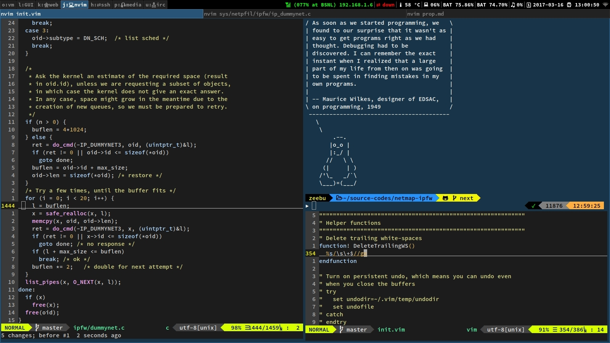

# @shivansh's dotfiles
Collection of all the configuration files made to ease and speed up the significant part of my life spent on shell. Well, these serve as a means of procrastination too.



---

## Requirements
* neovim/vim
* zsh
* [oh-my-zsh](http://ohmyz.sh/)
* [Powerline fonts](https://github.com/powerline/fonts#powerline-fonts)
* [Vim-Plug](https://github.com/junegunn/vim-plug#installation) (for plugin management)
* exuberant ctags **(optional)**
* cscope **(optional)**

## Installation
**Warning:** If you want to give these dotfiles a try, it's highly advisable to first review the code, and remove the unrequired things. Proceed at your own risk!

Run the following from project root -
```
./install.sh
```
Your current configuration files (_refer next section_) will be backed up and can be found under `$HOME/.backup.configs/`.

### Custom installation
For cherry-picking the configuration files, update the variable `rcList` in `install.sh` accordingly.
